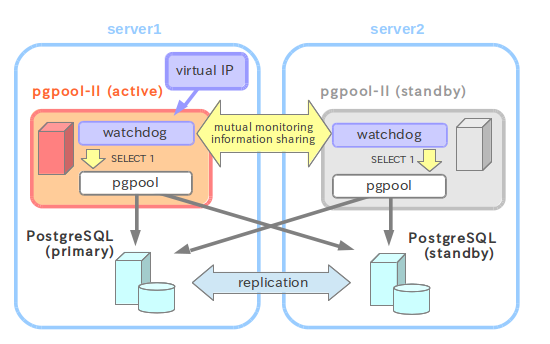

## PostgreSQL 异步主从流复制利用pgpool实现主备切换

### 参考文档

http://www.pgpool.net/docs/pgpool-II-3.5.4/doc/pgpool-zh_cn.html  
http://www.pgpool.net/docs/latest/en/html/index.html  
https://www.jianshu.com/p/f9d6fee05549  
https://www.jianshu.com/p/ef183d0a9213  
http://www.cnblogs.com/warmingsun/p/6738840.html  
http://www.habets.pp.se/synscan/files/  
https://jingyan.baidu.com/article/380abd0a1352781d90192cb0.html

### 简介

基于PG的流复制能实现主备切换，但是需要手工切换。对于一些HA场景来说，需要当主机宕机后，备机自动切换，经查询资料知道pgpool-II可以实现这种需求。本文基于PG流复制基础上 ，以pgpool-II实现主备切换。

### 系统架构



**pgpool-II双机集群服务**：pg主节点和备节点实现流复制热备，pgpool1，pgpool2作为中间件，将主备pg节点加入集群，实现`读写分离，负载均衡和HA故障自动切换`。两pgpool节点可以委托一个`虚拟ip节点`作为应用程序访问的地址，两节点之间通过watchdog进行监控，当pgpool1宕机时，pgpool2会`自动接管`虚拟ip继续对外提供不间断服务。


### 异步流复制环境的搭建部署

参考：[PostgreSQL 异步主从流复制部署](./stream_replication.md)

### 准备工作

1. 修改/etc/hosts

```
# 分别在master和slave主机上执行
192.168.137.5 master
192.168.137.6 slave
192.168.137.7 vip
```

2. 配置ssh免密码登录

``` shell
# 分别在master和slave主机上执行
ssh-keygen -t rsa
cat ~/.ssh/id_rsa.pub >> ~/.ssh/authorized_keys

# master主机执行
ssh-copy-id postgres@slave

# slave主机执行
ssh-copy-id postgres@master
```

3. 编译安装arping

* 安装依赖

```
# 分别在master和slave主机上执行
apt-get install libnet-dev
apt-get install libpcap-dev
```

* 安装arping

``` shell
# 分别在master和slave主机上执行
wget http://www.habets.pp.se/synscan/files/arping-2.19.tar.gz
tar -zxvf arping-2.19.tar.gz
cd arping-2.19/
./configure
make && make install
ln -s /usr/local/sbin/arping /usr/sbin/arping
chmod u+s /sbin/ifconfig
chmod u+s /usr/sbin
```

### 安装pgpool

```
# 分别在master和slave主机上执行
wget http://www.pgpool.net/download.php?f=pgpool-II-4.0.4.tar.gz
tar -zxvf download.php\?f\=pgpool-II-4.0.4.tar.gz
cd pgpool-II-4.0.4/
./configure --prefix=/opt/pgpool --with-pgsql=/opt/pg
make && make install

# 安装pg_reclass,pg_recovery函数
cd src/sql
make && make install

# 只在master主机上执行
psql -f insert_lock.sql template1
```

### 配置pgpool

1. 配置.bashrc

```
# 分别在master和slave主机上执行
export PGPOOLHOME=/opt/pgpool
export PATH=$PATH:/sbin:$PGPOOLHOME/bin
```

```
# 分别在master和slave主机上执行
. .bashrc
```

2. 配置pool_hba.conf

```
# 分别在master和slave主机上执行
cd /opt/pgpool/etc
cp pool_hba.conf.sample pool_hba.conf 
vi pool_hba.conf # 新增如下一行

host    all             all             0.0.0.0/0            trust
```

3. 配置pcp.conf

```
# 分别在master和slave主机上执行
cp pcp.conf.sample pcp.conf
pg_md5 vcs # 生成postgres用户的密码(vcs)对应的md5值
vi pcp.conf  # 新增如下一行
postgres:d6bfe3ce1bf5714887f4ffbb7b94feab

pg_md5 -p -m -u postgres pool_passwd # 输入密码后，在pgpool/etc目录下会生成一个pool_passwd文件
```

4. 配置pgpool.conf

```vim
# master主机
cp pgpool.conf.sample pgpool.conf
vi pgpool.conf # 调整以下参数

listen_addresses = '*'
backend_hostname0 = 'master'
backend_port0 = 9984
backend_data_directory0 = '/home/postgres/data'

backend_hostname1 = 'slave'
backend_port1 = 9984
backend_data_directory1 = '/home/postgres/data'

enable_pool_hba = on
pid_file_name = '/opt/pgpool/pgpool.pid'
logdir = '/opt/pgpool/log/pgpool'
load_balance_mode = on
master_slave_mode = on

sr_check_user = 'replica'
sr_check_password = 'replica'

health_check_user = 'postgres'
health_check_password = 'vcs'
health_check_database = 'postgres'

failover_command = '/opt/pgpool/failover_stream.sh %H '

use_watchdog = on
wd_hostname = 'master' # 本机
delegate_IP = 'vip'
if_up_cmd = 'ifconfig ens33:0 inet $_IP_$ netmask 255.255.255.0'
if_down_cmd = 'ifconfig ens33:0 down'

heartbeat_destination0 = 'slave' # 对端
heartbeat_device0 = 'ens33'
other_pgpool_hostname0 = 'slave' # 对端
other_pgpool_port0 = 9999
other_wd_port0 = 9000
```

```vim
# slave主机
cp pgpool.conf.sample pgpool.conf
vi pgpool.conf # 调整以下参数

listen_addresses = '*'
backend_hostname0 = 'master'
backend_port0 = 9984
backend_data_directory0 = '/home/postgres/data'

backend_hostname1 = 'slave'
backend_port1 = 9984
backend_data_directory1 = '/home/postgres/data'

enable_pool_hba = on
pid_file_name = '/opt/pgpool/pgpool.pid'
logdir = '/opt/pgpool/log/pgpool'
load_balance_mode = on
master_slave_mode = on

sr_check_user = 'replica'
sr_check_password = 'replica'

health_check_user = 'postgres'
health_check_password = 'vcs'
health_check_database = 'postgres'

failover_command = '/opt/pgpool/failover_stream.sh %H '

use_watchdog = on
wd_hostname = 'slave' # 本机
delegate_IP = 'vip'
if_up_cmd = 'ifconfig ens33:0 inet $_IP_$ netmask 255.255.255.0'
if_down_cmd = 'ifconfig ens33:0 down'

heartbeat_destination0 = 'master' # 对端
heartbeat_device0 = 'ens33'
other_pgpool_hostname0 = 'master' # 对端
other_pgpool_port0 = 9999
other_wd_port0 = 9000
```

5. 新建failover_stream.sh脚本

```sh
# 分别在master和slave主机上执行
cd /opt/pgpool
touch failover_stream.sh
vi failover_stream.sh # 增加如下内容

#! /bin/sh 
# Failover command for streaming replication. 
# Arguments: $1: new master hostname. 

new_master=$1 
trigger_command="$PGHOME/bin/pg_ctl promote -D $PGDATA" 

# Prompte standby database. 
/usr/bin/ssh -T $new_master $trigger_command 

exit 0; 
```

```
# 分别在master和slave主机上执行
chmod +x failover_stream.sh
```

6. 创建pgpool日志文件夹

```shell
# 分别在master和slave主机上执行
mkdir -p /opt/pgpool/log/pgpool
```

### pgpool集群管理

1. 启动pg

```
# 分别在master和slave主机上执行
pg_ctl start
```

2. 启停pgpool

```
# 分别在master和slave主机上执行
# 启动pgpool
pgpool -n -D > /opt/pgpool/log/pgpool/pgpool.log 2>&1 &

# 停止pgpool
pgpool -m fast stop
```

3. 查看集群节点状态

```
# 分别在master和slave主机上执行
psql -h vip -p 9999
postgres=# show pool_nodes;
 node_id | hostname | port | status | lb_weight |  role   | select_cnt | load_balance_node | replic
ation_delay | last_status_change  
---------+----------+------+--------+-----------+---------+------------+-------------------+-------
------------+---------------------
 0       | master   | 9984 | up     | 0.500000  | primary | 0          | true              | 0     
            | 2019-04-07 00:56:38
 1       | slave    | 9984 | up     | 0.500000  | standby | 0          | false             | 0     
            | 2019-04-07 00:56:38
(2 rows)

postgres=#
```

4. 模拟master主机pgpool宕机

master主机上的pgpool宕机后，由slav主机的pgpool接管vip和集群服务，并未中断应用访问。

```
# master主机
pgpool -m fast stop
psql -h vip -p 9999
postgres=# show pool_nodes;
 node_id | hostname | port | status | lb_weight |  role   | select_cnt | load_balance_node | replic
ation_delay | last_status_change  
---------+----------+------+--------+-----------+---------+------------+-------------------+-------
------------+---------------------
 0       | master   | 9984 | up     | 0.500000  | primary | 0          | false             | 0     
            | 2019-04-07 10:05:37
 1       | slave    | 9984 | up     | 0.500000  | standby | 0          | true              | 0     
            | 2019-04-07 10:05:37
(2 rows)

postgres=#
```

5. 模拟master主机pg宕机

```
# master主机
pg_ctl stop
psql -h vip -p 9999
postgres=# show pool_nodes;
 node_id | hostname | port | status | lb_weight |  role   | select_cnt | load_balance_node | replic
ation_delay | last_status_change  
---------+----------+------+--------+-----------+---------+------------+-------------------+-------
------------+---------------------
 0       | master   | 9984 | down   | 0.500000  | standby | 0          | false             | 0     
            | 2019-04-07 10:07:01
 1       | slave    | 9984 | up     | 0.500000  | primary | 0          | true              | 0     
            | 2019-04-07 10:07:01
(2 rows)

postgres=#

# slave已经被切换成primary，且master节点状态是down
```

6.  修复master主机重新加入集群

```
主库降级成备库之前先使用pg_rewind同步下数据目录，防止直接启动由于时间线不一致导致的数据不一致问题
```

```
# master主机
cd $PGDATA
mv recovery.done recovery.conf
pg_ctl start

# 注意master的node_id是0，所以-n 0
pcp_attach_node -d -U postgres -h vip -p 9898 -n 0
postgres=# show pool_nodes;
 node_id | hostname | port | status  | lb_weight |  role   | select_cnt | load_balance_node | repli
cation_delay | last_status_change  
---------+----------+------+---------+-----------+---------+------------+-------------------+------
-------------+---------------------
 0       | master   | 9984 | waiting | 0.500000  | standby | 0          | false             | 0    
             | 2019-04-07 10:08:29
 1       | slave    | 9984 | up      | 0.500000  | primary | 0          | true              | 0    
             | 2019-04-07 10:07:01
(2 rows)

postgres=#
```